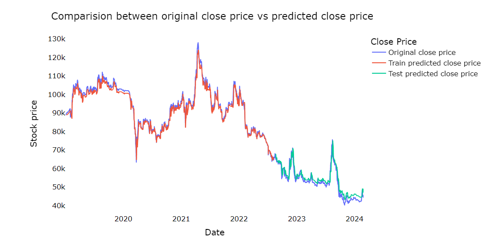
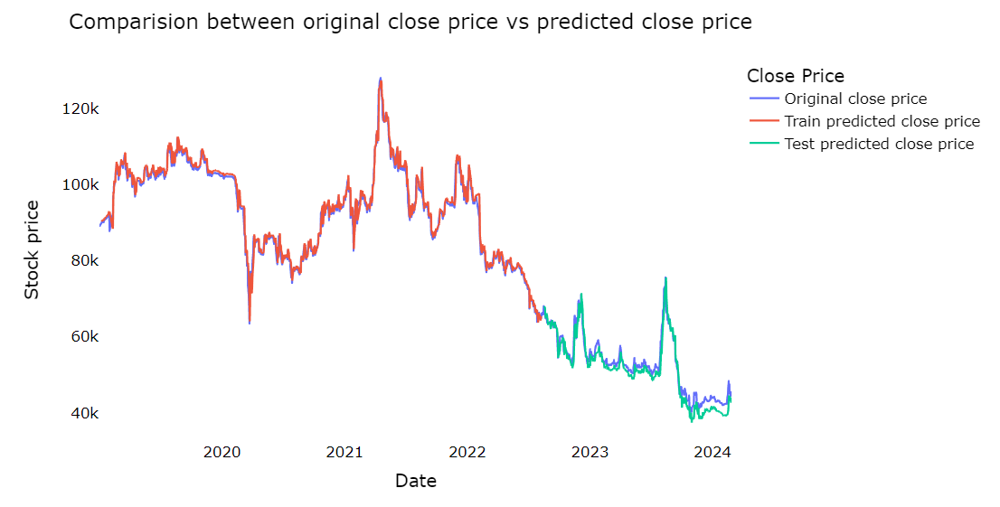

# Predicting Vietnamese Stock Price with LSTM and LSTM + GRU

## Description

This project utilizes Long Short-Term Memory (LSTM) and LSTM combined with Gated Recurrent Unit (GRU) models to predict the closing prices of Vietnamese stock market data. The dataset used in the project consists of historical stock prices of the top 100 companies listed on the Vietnamese stock exchange.

## Methodology

1. **Data Preparation:**
   - The dataset is imported and preprocessed, including converting the date format, sorting the dataset by date, and normalizing the closing prices to a range between 0 and 1 using MinMaxScaler.

2. **Data Splitting:**
   - The dataset is split into training and testing sets with a ratio of 70:30. Time series data is created with a specified time step to feed into the LSTM model.

3. **Model Building:**
   - Two types of models are built: LSTM and LSTM + GRU. Both models are designed with multiple layers of LSTM and GRU units followed by a dense layer for prediction. The models are compiled using mean squared error as the loss function and Adam optimizer.

4. **Model Training:**
   - The models are trained using the training dataset and evaluated using the testing dataset. The training process involves fitting the models to the training data for a specified number of epochs.

5. **Performance Evaluation:**
   - Various performance metrics such as explained variance score, R-squared score, root mean square error (RMSE), mean squared error (MSE), and mean absolute error (MAE) are calculated to assess the accuracy and reliability of the models in predicting stock prices.

6. **Visualization:**
   - Visualizations are created to compare the original stock prices with the predicted prices generated by the models. Line plots illustrate the trends and patterns in both the training and testing data, allowing for a qualitative assessment of the model predictions.

  <i>Plot 1: Comparison between original stock prices and predicted prices using LSTM model</i>

  <i>Plot 2: Comparison between original stock prices and predicted prices using LSTM+GRU model</i>

7. **Future Prediction:**
   - Finally, the trained models are used to predict the closing prices for the next 10 days. These predictions are visualized alongside the actual stock prices, providing insights into the future trends of the Vietnamese stock market.

## Conclusion

This project demonstrates the effectiveness of LSTM and LSTM + GRU models in predicting Vietnamese stock prices based on historical data. By leveraging deep learning techniques, investors and stakeholders can gain valuable insights into potential future trends in the Vietnamese stock market, aiding in decision-making processes and portfolio management strategies.

